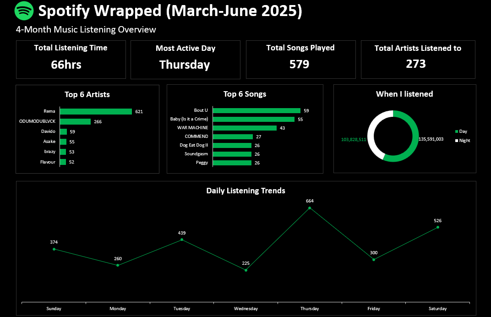

## Spotify Analytics Dashboard (March–June 2025)

This project is a personalized music analytics dashboard built using data from my Spotify listening history. Inspired by Spotify Wrapped, it visualizes my music habits between **March and June 2025**.

---

## Project Overview

I downloaded my Spotify data (in JSON format), cleaned and transformed it in **Microsoft Excel**, and created an interactive dashboard using **pivot tables** and **charts**.
The goal was to explore my listening trends and present them in a visually compelling, story-driven format.

---

## Key Dashboard Insights

-  **Top 6 Artists** based on play count 
-  **Top 6 Songs** by play count  
-  **Most Active Listening Day**  
-  **Total Listening Time** in hours  
-  **Listening Time Breakdown** — Day vs Night  
-  **Daily Listening Trends** (Sunday to Saturday)
-  **Total Songs Played**
-  **Total Artists Listened To**

---

## Tools Used

- **Microsoft Excel**
  - Pivot Tables
  - Bar, Line, Area, and Pie Charts
  - Power Query for Data Cleaning and Transformation
- JSON to Excel Converter
  

---

## 🖼️ Dashboard Preview

---

##  Motivation

This project helped me:
- Practice real-world data analysis and visualization in Excel  
- Turn raw data into a meaningful, interactive story  
- Build something fun and portfolio-worthy using personal data

---

##  Data Source

- Personal Spotify listening data, downloaded via [Spotify’s Data Request Portal](https://www.spotify.com/us/account/privacy/)

---

##  Status

 Completed — Built entirely in Excel.

---

##  Author

**Chidera Stephanie Ughamadu**  
Data Analyst

